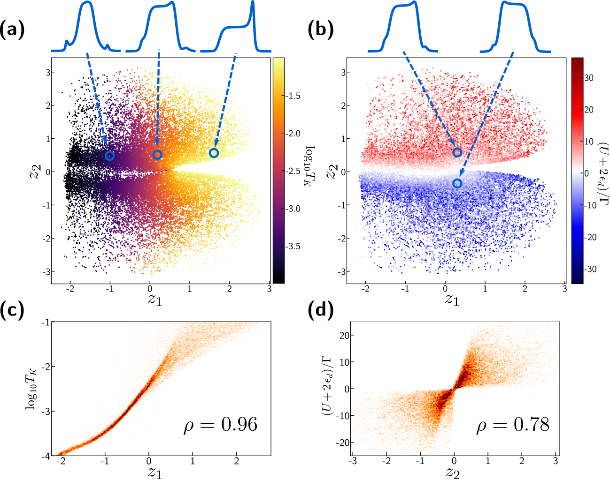
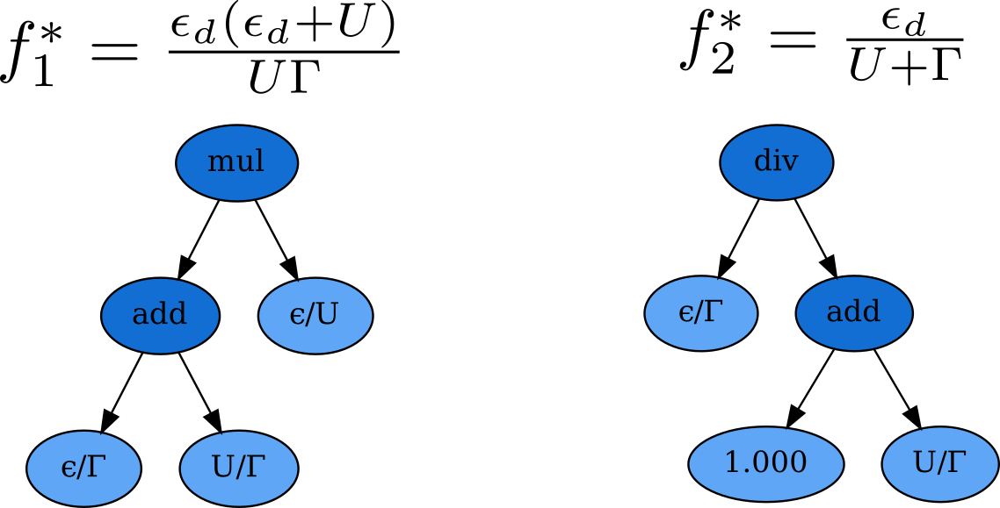

# Extracting physics from spectral functions using VAEs
This repository contains all code to generate the results of the paper:
_Machine-learning Kondo physics using variational autoencoders_. Trains and visualizes
latent spaces of VAEs trained on datasets of spectral functions generated from the single-impurity
Anderson model. Developed by Cole Miles and Matthew Carbone.

## Requirements
Package versions correspond to those used to run this code originally. Lower versions
may work, but are untested.

```
    python     >= 3.6.8
    numpy      >= 1.19.5
    torch      >= 1.7.1
    matplotlib >= 3.3.3
    pandas     >= 1.2.0
    jupyter               (to run visualization notebook)
    gplearn    >= 0.4.1   (to run symbolic regression in notebook)
```

## How to use

VAEs can be trained using the `run.py` script. An example execution which shows all
useful arguments looks like:

```
python run.py --model vae --latent-size 10 --save-model ./models/my_model.pt -e 2000 \
              --batch-size 1024 --indices ./data/anderson/indices/lowBlowT_indices.pkl \
              --kl-strength 1.0 --seed 1111
```

After this has completed, a saved VAE model should be saved as a `.pt` file at the specified
save location (here, `./models/my_model.pt`). In `models/`, we provide the two trained models
examined in the main text of the manuscript as loadable `.pt` files.

The Jupyter notebook `notebooks/explore_latents.ipynb` loads these examplary VAEs, which have been
trained on two different datasets, and performs extensive visualization to examine the learned
latent space structures. We find that often, the learned latents directly correspond with
known physically-relevant features!



Also in the same notebook is a demonstration of applying symbolic regression to extract
explicit symbolic formula characterizing these physical descriptors from the structure of
a learned VAE latent space.

